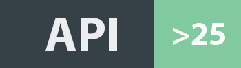
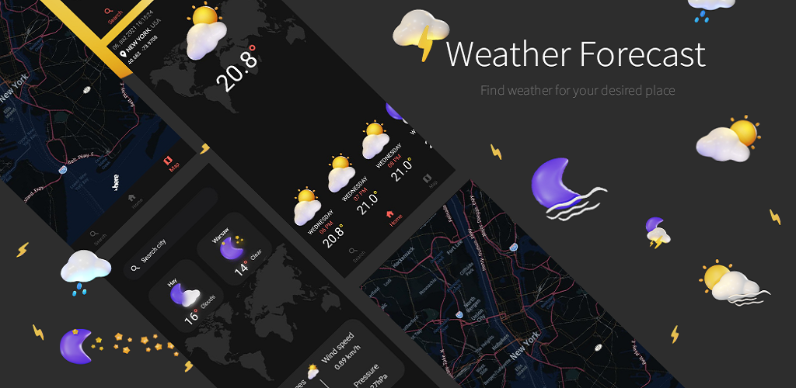
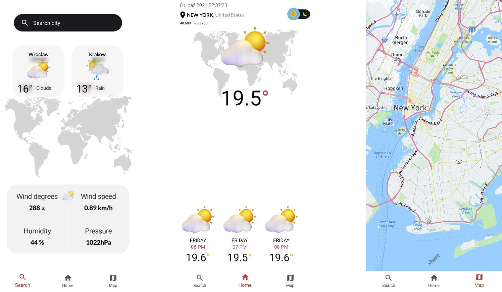
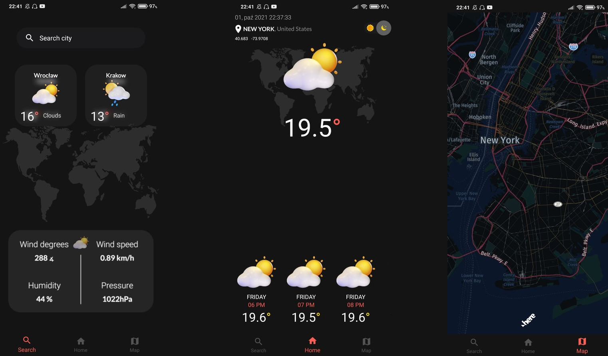

 # ☁️ Weather Forecast    

      
 

 
 # Tech Stack
 
 * Kotlin
 * MVVM 
 * ViewBinding
 * Dagger + Hilt
 * Retrofit ( 2 API's ) + Gson + Callback library
 * HERE maps SDK
 * Room
 * Flows
 

  
 

  
 <h3>Desired UI</h3>
<a href="https://dribbble.com/shots/15162632-Weather-app">
UI design Author</a>
  
<a href="https://figmaelements.com/3d-weather-icons-pack/">Icons Author</a>
 

## Preview

  <h3>Light Mode</h3>

      

 <h3>Dark Mode</h3>

      
   

